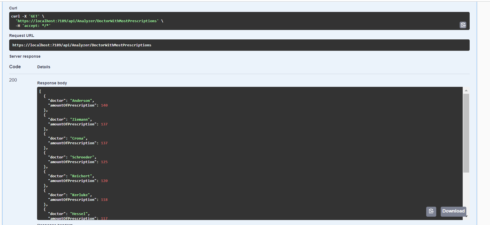

# DBD-Exam-Project
We were given an assignment in our database exam project to construct a project that included four of the five databases from our course. The team chose PostgreSQL, Neo4J, MongoDB, and Redis for the project. The project is based on a previously submitted hand-in assignment from one of our database assignments (Postgres). That project was merely about how to use Postgres and create a functional prescription service (handling of prescriptions). We have expanded this prescription service to cover three additional databases and four new services in the original project. The final product is much more than just a prescription service as it was in the beginning.

# Connectionstrings for dev:
All require running .start-dev.bat from root of repository (shortcut for docker-compose up with the databases along with services that have been containerized)
This will set up databases and services on the following ports:

| Service  | Local Development | From other docker containers |
|----------|-------------------|------------------------------|
| Postgres                | localhost:15432   | postgres:5432           |
| Mongo                   | localhost:17017   | mongo:27017             |
| Neo4j                   | localhost:17474   | neo:7474              |
| Neo4j                   | localhost:17687   | neo:7687              |
| Redis                   | localhost:16379   | redis:6379              |
| Consultation Service    | localhost:18090   | consultation-service:80 |
| Mail Service            | localhost:18092   | mail-service:80         |
| Prescription Service    | localhost:18093   | prescription-service:80 |
| Test Data Api           | localhost:18094   | testdata-service:80     |
| CronJob Service         | localhost:18095   | cronjob-service:80      |
| Data Analyzing Service  | localhost:18096   | analyzing-service:80    |
| Blazor Frontend         | localhost:8080    | blazor-frontend:80 |

| Tool | Url |
| - | - |
| PG Admin | http://localhost:10010
| Mongo Express | http://localhost:10020
| Redis Insight | http://localhost:10030

## Data Analyzing Service (Neo4J)
The service consists of a data supplier and a data analyzer. 

Data supplier takes the data from our two other services named Prescription Service (Postgres/Redis) and Consultation Service (Mongo.). The data from these services will then be supplied to Neo4J through our bolt port (bolt://localhost:17687). The supplier also adds relations between the data. 

Diagram of relations in Neo4J:

Picture of the supplier:

Our Data Analyzer consists of three examples in the project. It analyzes the created relations between our node classes to find helpful knowledge about our data.

Picture of the method (DoctorWithMostPrescriptions):

Picture of the method executed:

## ConsultationService (mongo)
Service for creating, booking and retrieving consultations.

When running through docker the service is accessed at http://localhost:18090/

### Example of geolocation

When getting bookings available near you, you pass long/lat and distance in meters as path params.
10.000m will be slightly less than 0.09 latitude, as seen here:

While >= 0.09 difference will not return a result: 

